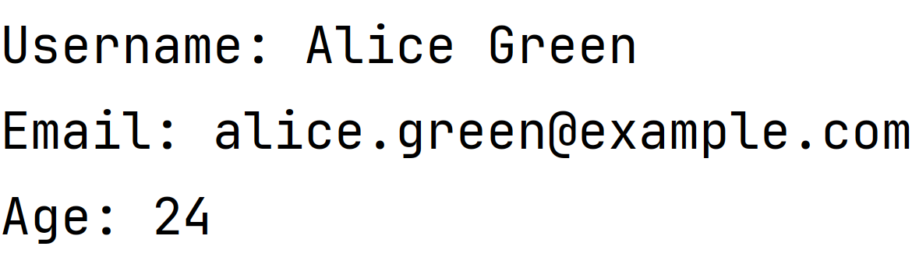

# Welcome to Practical Test Automation
### Sprint 1 OOP Fundamentals

### Task 1 RegistrationForm Class
Create the public **RegistrationForm** class for storing and managing user registration form data.

**Class Fields**:
- Username (`String username`)
- Email (`String email`)
- Password (`String password`)
- Confirm Password (`String confirmPassword`)
- Phone Number (`String phoneNumber`)
- Birth Date (`String birthDate`)

All fields have a private type.

**Constructors**

- Default constructor.
- Parameterized constructor for initializing all fields. 
- Both constructors are public.

**Access Methods**

- Getters and setters for fields, where it's necessary.

**Method for Calculating User's Age**

- Calculate age based on the birthdate, named method `calculateAge()`.

 `calculateAge()`**Method Requirements:**

**Input Exceptions**:

- **Null and Empty String Check**:
    - If the input parameter `birthDate` is `null` or an empty string, the method must throw an `IllegalArgumentException` with the message: `"Birth date cannot be null or empty"`.

- **Date Format Validation**:
    - The birthdate has to be in the "yyyy-MM-dd" format. If parsing fails due to an incorrect format, a `DateTimeParseException` should be thrown, carrying the message: `"Invalid birth date format. Please use yyyy-MM-dd."`.

- **Future Date Check**:
    - If the parsed birthdate (`birthdate`) occurs after `LocalDate.now()`, an `IllegalArgumentException` should be thrown with the message: `"Birth date cannot be in the future"`.

**Method for Displaying User Information**

- `displayUserInfo()`: Outputs user information: username, email, and calculated age.

**Usage Example**
- When implementing a class, uncomment the test class code. Run the tests to verify the implementation.
- Create an instance of the **RegistrationForm** class.
- Initialize the instance with test data.
- Use the `displayUserInfo()` method to display user information.
For example:
